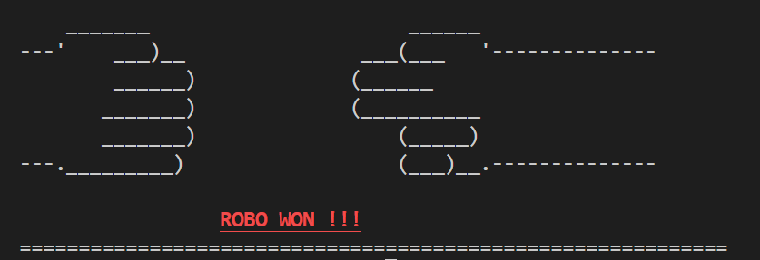
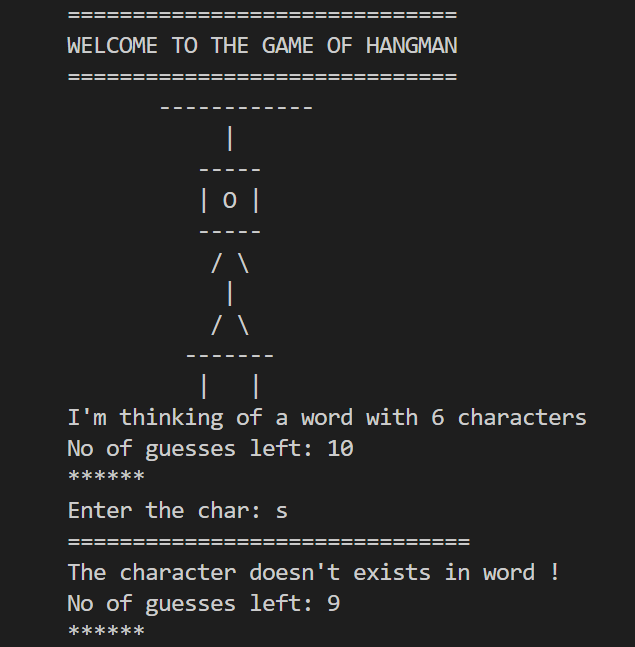
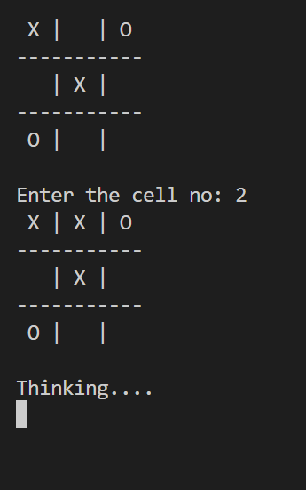

# Python Games Collection 🎮

[](https://www.python.org/)
[](https://en.wikipedia.org/wiki/Command-line_interface)

A collection of classic terminal-based games implemented in Python. Developed as part of programming fundamentals coursework.

## Games List 🕹️

### 1. Stone Paper Scissors ✊✋✌️
**Features:**
- ASCII art animations
- Colored terminal output
- Input validation
- Win/lose animations
- Computer opponent

**Run:**
```bash
python stone-paper-scissors.py
```

### 2. Hangman 💀
**Features:**
- Random word selection
- Score tracking
- ASCII art graphics
- Guess counter
- Win/lose states

**Run:**
```bash
python hangman.py
```

### 3. Tic-Tac-Toe ❌⭕
**Features:**
- Grid-based UI
- Computer opponent
- Win condition checking
- Turn-based gameplay
- Input validation

**Run:**
```bash
python tic-tac-toe.py
```

## Installation & Requirements 🛠️

**Dependencies:**
```bash
pip install termcolor get-key
```

**Clone Repository:**
```bash
git clone https://github.com/prabhnoor1358/python-games.git
cd python-games
```

## How to Play 🎮

| Game               | Controls                          | Special Features                |
|--------------------|-----------------------------------|----------------------------------|
| Stone Paper Scissors| 0 (Rock), 1 (Paper), 2 (Scissors) | Animated battle sequences        |
| Hangman            | Keyboard letter input             | Progressive hangman drawing      |
| Tic-Tac-Toe        | Numpad 1-9 for grid positions     | Smart computer opponent          |

## Screenshots 📸

<!-- Add your screenshots in this table -->
| Stone Paper Scissors | Hangman | Tic-Tac-Toe |
|----------------------|---------|-------------|
|  |  |  |

## Code Structure 📂
```
python-games/
├── stone-paper-scissors.py
├── hangman.py
├── tic-tac-toe.py
├── README.md
└── screenshots/
    ├── sps.png
    ├── hangman.png
    └── ttt.png
```

## Academic Context 📚
**Course:** Programming Fundamentals  
**University:** Chitkara University  
**Objectives Met:**
- Control structures implementation
- Object-oriented programming
- External module integration
- User input handling
- Algorithm design


## License 📄
This project is licensed under the [MIT License](/LICENSE)

---

**Developed with ❤️ by Prabhnoor Singh** 

[](https://github.com/prabhnoor1358/python-games)
